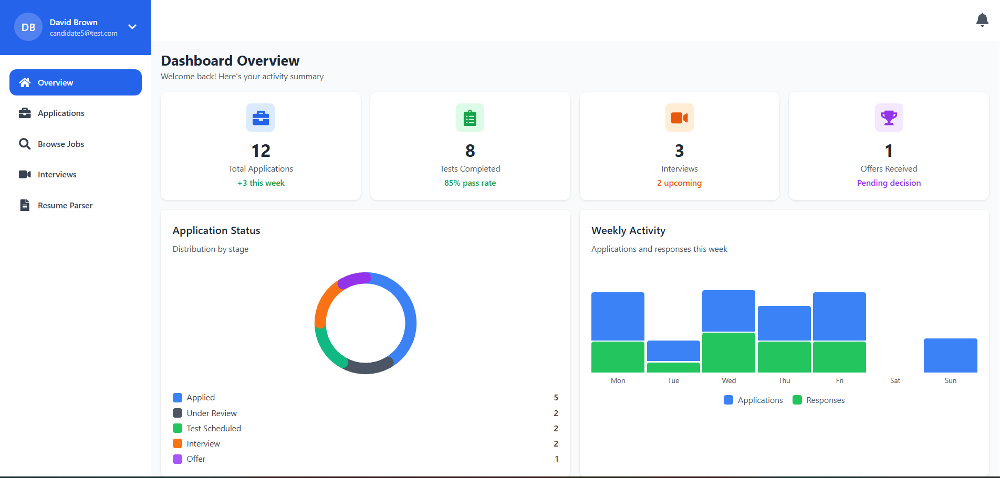
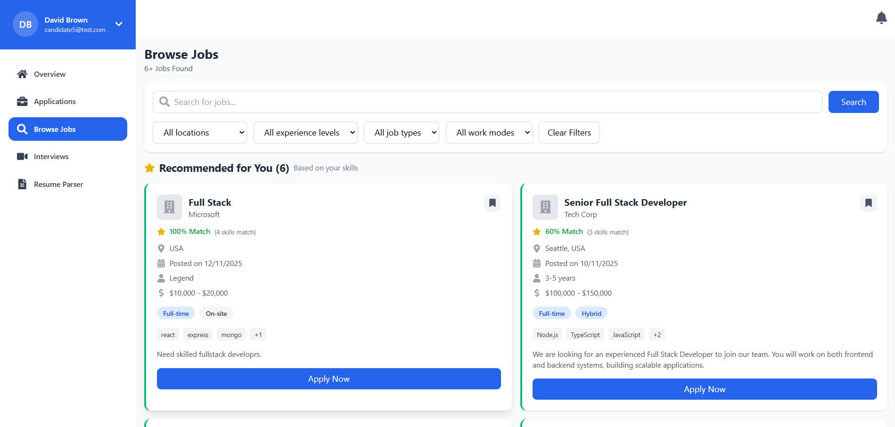
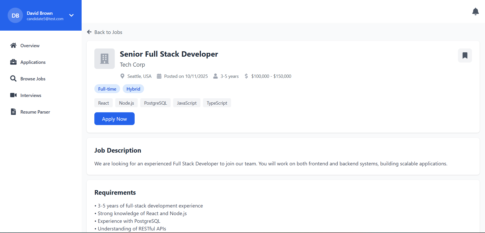
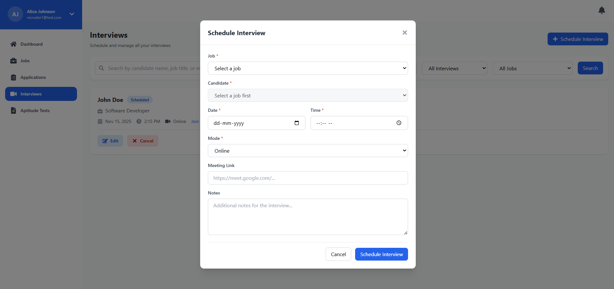
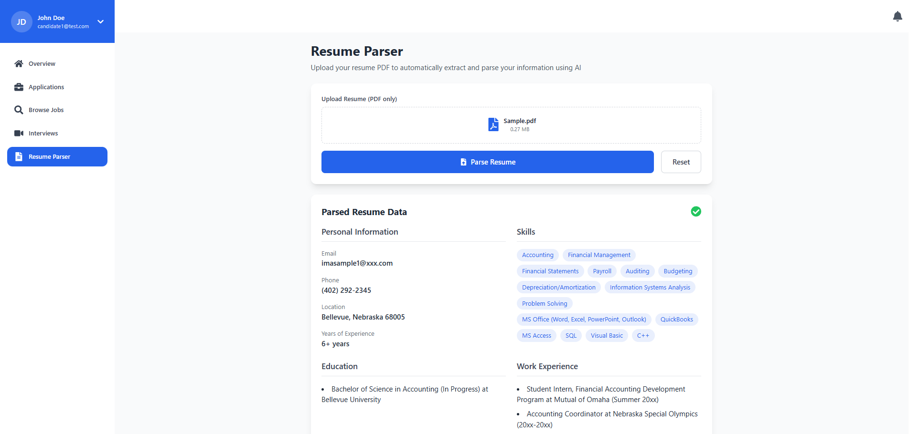
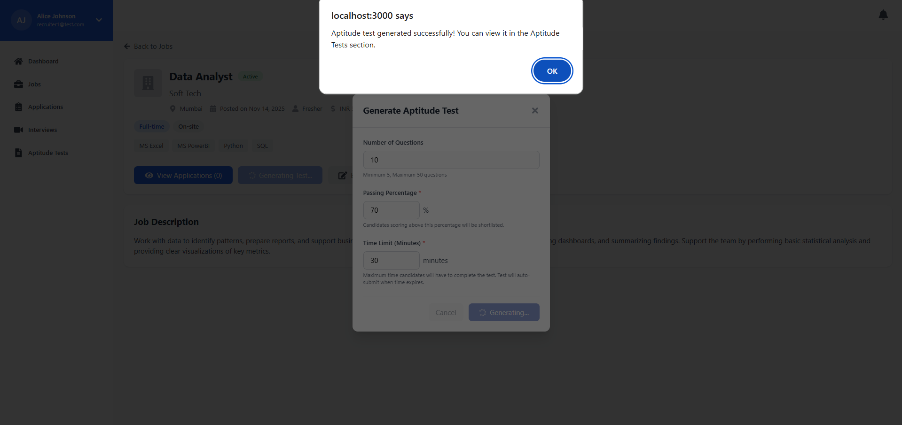

# 🚀 **AI-Powered Hiring Platform (React + Node.js + PostgreSQL + Sequelize + Gemini API)**

A full-stack hiring platform designed to streamline recruitment workflows with features like job posting, candidate applications, interview scheduling, and **AI-powered resume parsing and automated test generation** using the **Google Gemini API**.
The platform includes **full Role-Based Access Control (RBAC)** and a clean, card-based UI for a seamless experience for candidates and recruiters.

---

## ✨ **Features**

### 🔹 Core Platform

* **Job Posting & Management**
  Recruiters can create, update, and manage job openings.

* **Card-Based UI**
  Clean, intuitive job listing design for easy browsing.

* **Candidate Applications**
  Applicants can browse job cards and submit applications effortlessly.

* **Interview Scheduling**
  Recruiters can schedule interviews with shortlisted candidates.

### 🔐 **Role-Based Access Control (RBAC)**

* Secure route protection for:

  * **Recruiter**
  * **Candidate**

### 🤖 **AI Features (Google Gemini API)**

* **AI Resume Parsing**
  Automatically extracts structured candidate information (skills, education, experience, etc.).

* **AI Test Generation**
  Creates job-specific technical tests based on required skills and difficulty level.

### 🛠 **Tech Stack**

* **Frontend:** React.js
* **Backend:** Node.js, Express.js
* **Database:** PostgreSQL
* **ORM:** Sequelize
* **Authentication:** JWT + RBAC
* **File Uploads:** Multer
* **AI Integration:** Google Gemini API
* **UI:** Custom card-based design using CSS

---

# 🔧 **Installation & Setup**

## **1️⃣ Clone the Repository**

```bash
git clone https://github.com/kenils26/HireFlow.git
```

---

# **2️⃣ Backend Setup**

```bash
cd backend
npm install
```

### Create a `.env` file inside `/backend`

(You can use `.env.example` as the reference)

```
PORT=5000
NODE_ENV=development

DB_HOST=localhost
DB_PORT=5432
DB_NAME=fig_hiring_platform
DB_USER=postgres
DB_PASSWORD=your_postgres_password

JWT_SECRET=your_jwt_secret_here
JWT_EXPIRE=7d

UPLOAD_DIR=./uploads
MAX_FILE_SIZE=10485760

FRONTEND_URL=http://localhost:3000
GEMINI_API_KEY=your_gemini_api_key_here
```

### Run Sequelize Migrations

```bash
npx sequelize db:migrate
```

### Start Backend Server

```bash
npm run dev
```

Backend runs on:
👉 [http://localhost:5000](http://localhost:5000)

---

# **3️⃣ Frontend Setup**

```bash
cd ../frontend
npm install
```

### Start Frontend

```bash
npm start
```

Frontend runs on:
👉 [http://localhost:3000](http://localhost:3000)

---

# 📸 **Screenshots**


#### **Home Page**



#### **Job Listings (Card UI)**



#### **Apply Page**



#### **Interview Scheduling**



#### **AI Resume Parsing**



#### **AI Test Generation**



---


# 🚀 **Project Status**

✔️ Role-Based Access Control completed
✔️ AI Resume Parsing working
✔️ AI Test Generation working
✔️ PostgreSQL + Sequelize integrated
✔️ Card-based UI functional

🔧 **Possible Upcoming Enhancements**

* Improved UI/UX
* Email notifications
* Interview Call Integration (Audio/Video)
* Built-In Code Editor for Assessments

---

# 🤝 **Contributing**

Contributions, issues, and feature requests are welcome.

---

# ⭐ **Support**

If you find this project helpful, please consider giving it a **⭐ on GitHub**.

